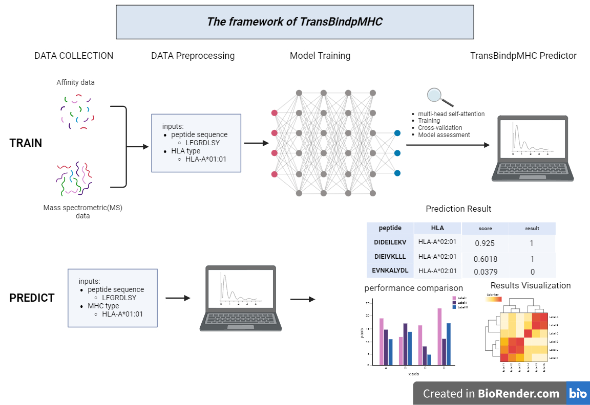
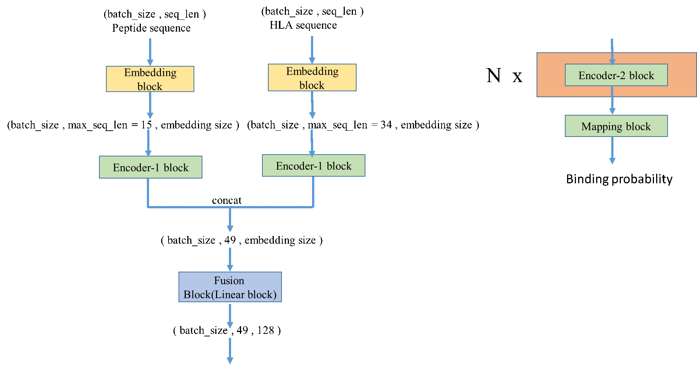

# TransBindpMHC-V1

- [TransBindpMHC-V1](#transbindpmhc-v1)
  - [Introduction](#introduction)
      - [Architecture](#architecture)
  - [clone the project](#clone-the-project)
  - [Installation](#installation)
  - [Usage](#usage)
      - [云端可视化平台](#云端可视化平台)
      - [本地部署](#本地部署)
  - [visualization](#visualization)
      - [模型对不同多肽长度的预测偏好](#模型对不同多肽长度的预测偏好)
      - [模型对不同 MHC 类型的预测偏好](#模型对不同-mhc-类型的预测偏好)
  - [Notes](#notes)
  - [References](#references)
  - [Cite](#cite)


## Introduction

癌症是导致人类死亡的第二大疾病，尽管医学发展迅速，但传统治疗方法对晚期及转移性肿瘤疗效有限。近年来，肿瘤免疫治疗如嵌合抗原受体T细胞疗法和免疫检查点抑制剂等展现出良好的疗效，成为新的研究热点。其中，肿瘤新抗原（neoantigen）被认为是免疫治疗的理想靶标，如何精准鉴定新抗原成为一大挑战。

准确预测主要组织相容性复合物I（MHC-I）与多肽的结合是提高新抗原鉴定效率的关键。使用质谱鉴定的 MHC 结合多肽相较于亲和力实验鉴定的 MHC 结合肽段，涵盖更丰富的细胞呈递抗原信息。另外，与传统实验方法相比，基于深度学习的计算预测方法可以更快速和准确地完成这一任务。因此，本研究基于Transformer模型对质谱来源的数据进行建模，构建了一种新型多肽-MHC结合预测方法TransBindpMHC。

我们全面评估了TransBindpMHC的性能。结果显示，在MHC类型罕见且训练中未见过的泛化数据集上， TransBindpMHC的精准率达到0.9055，初步验证了模型的泛化能力。进一步，在多肽-主要组织相容性复合物（pMHC）结合预测任务上，无论是在多批次、分布差异大的测试数据集，还是大规模、多MHC类型的评价数据集上， TransBindpMHC在多种评价指标上均具有相当或优于此六种主流算法的表现。接下来，在经过实验验证的HPV和肿瘤新抗原数据集上，结果也展现出了卓越的预测精度，特别是在新抗原数据集上的准确率达到了0.932。最后，为了探究TransBindpMHC在不同条件下的适用性，分析了该方法在不同肽长度和MHC类型上的预测偏好。结果表明，该方法在不同肽长度和MHC类型上均具有较强的预测能力。同时，为了方便用户零代码使用此方法，我们提供了一个可直接访问的在线网站（https://xuhu-transbindpmhc.streamlit.app/）。

综上所述，本研究基于肿瘤新抗原发挥作用过程中的多肽-MHC相互作用，构建了一种泛MHC类型、多物种（目前支持人、小鼠）、支持8-15长度的多肽序列、能较好的表征大部分中国人常见 HLA 分子类型的pMHC结合预测新方法TransBindpMHC。在多个评估任务上，该方法展现出优异的预测性能和稳定性。最后探讨了其在临床中的应用前景，为临床精准肿瘤免疫治疗提供了有价值的计算工具。


#### Architecture

<p align="center">
  
</p>

<p align="center">
  
</p>

## clone the project

```bash
git clone https://github.com/xuhu0115/TransBindpMHC-V1
cd TransBindpMHC-V1
```

## Installation

- Install from pip 
```bash
pip install -r requirements.txt
```
- Install from conda
```bash
conda env create -f environment.yml
```

## Usage

#### 云端可视化平台

[TransBindpMHC-V1](https://xuhu-transbindpmhc.streamlit.app/)

#### 本地部署

先准备相关数据，具体格式如下所示。然后在命令行运行 prediction 脚本，可返回预测结果，若想修改参数或者保存结果到目的路径，请修改 predict 的主函数。

- 输入两个 FASTA 文件

    - 多肽序列文件 (FASTA 格式)

      ```fasta
      >Peptide_1
      AEAFIQPI
      >Peptide_2
      KILRGVAK
      >Peptide_3
      MVWIQLGL
      ``` 

    - MHC 类型文件 (FASTA 格式)

      ```fasta
      >HLA-1
      HLA-A*02:01
      >HLA-2
      HLA-B*07:02
      >HLA-3
      HLA-C*04:01
      ```    

    - 预期输出:

      ```
      HLA         HLA_sequence  peptide    y_pred  y_prob
      HLA-A*02:01 ASNENM...ETM     AEAFIQPI   1       0.9213
      HLA-A*02:01 ASNENM...ETM     KILRGVAK   0       0.2541
      HLA-A*02:01 ASNENM...ETM     MVWIQLGL   1       0.8792
      HLA-B*07:02 IRAQDL...WTY     AEAFIQPI   0       0.1652
      HLA-B*07:02 IRAQDL...WTY     KILRGVAK   1       0.7893
      HLA-B*07:02 IRAQDL...WTY     MVWIQLGL   0       0.4215
      HLA-C*04:01 RVDSFT...DNR     AEAFIQPI   0       0.3124
      HLA-C*04:01 RVDSFT...DNR     KILRGVAK   1       0.8051
      HLA-C*04:01 RVDSFT...DNR     MVWIQLGL   1       0.6982
      ```     


- 直接输入多肽序列和MHC类型进行预测

    - 多肽序列输入

      `AEAFIQPI`

    - MHC 类型文件 (FASTA 格式)

      `HLA-A*11:01`   

    - 预期输出:

      ```
      HLA         HLA_sequence  peptide    y_pred  y_prob
      HLA-A*11:01 ASNENM...ETM  AEAFIQPI     1     0.9213
      ```     

## visualization

#### 模型对不同多肽长度的预测偏好

请查看`方法的批量评估\5_模型对不同肽长度的预测偏好.ipynb`的使用方法！

#### 模型对不同 MHC 类型的预测偏好

请查看`方法的批量评估\5_模型对不同MHC的预测偏好.ipynb`的使用方法！

## Notes

## References

## Cite


